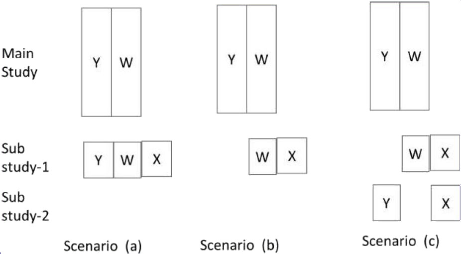

# Data Generation

```{r}
library(dplyr)
library(MASS)
library(mice)
library(VIM)
library(tidyverse)

set.seed(420)

n <- 1000
mean <- seq(0,2)
vcm <- matrix(data = c(1,1,1.7,1,2, 1.5, 1.7, 1.5, 4), nrow = 3, byrow = T)

data <- mvrnorm(1000, mean, vcm) %>% data.frame()
colnames(data) <- c("X", "Y", "W")
```


# task a)

The goal is to infer about the regression coefficient for X in the model $Y = \beta_0 + \beta_1X + \varepsilon , \varepsilon \sim N(0, \sigma^2)$. Set aside the first 900 observations as data from the main study and treat the remaining 100 observations as data from a substudy. Fit the above regression model on the main study data and store the point estimates of $\beta_0$, $\beta_1$ and $\sigma^2$ and the interval estimate of $\beta_1$.

```{r}
#Set aside first 900 obs as data from main study
Main <- data %>% slice_head(n = 900)

#Remaining 100 observations as data from a substudy
Sub <- data %>% slice_tail(n = 100)

#Fit regression model on the main study 
Main.lm <- lm(Y ~ X, data = Main)
beta_0_main <- lm(Y ~ X, data = Main)$coef[1]
beta_1_main <- lm(Y ~ X, data = Main)$coef[2]
Sigma_main <- sigma(Main.lm)

int_est_beta_1 <- confint(Main.lm)[2,]
```


# task b)

Create a data corresponding to scenario (a) in Figure 8.1 by deleting X from the main study. Multiply impute the missing values of X in the main study. Perform multiply imputed analysis and again store the point and interval estimates of the same parameters.



* Figure 8.1 not included in the script

```{r}
#Copy the original dataset
Main_b <- Main

#Remove X from Main dataset
Main_b["X"] <- NA

#Impute X values of the main dataset
initImp <- mice(Main_b, maxit = 1)
```

# task c)

Create a data corresponding to scenario (b) by deleting X values from the main study and Y values from the substudy. Multiply impute the missing values of X in the main study. Perform multiply imputed analysis as in (b).

```{r}
#Copy the original dataset
Main_c <- Main
Sub_c <- Sub

#Remove X from Main dataset
Main_c["X"] <- NA
#Remove Y from Sub dataset
Sub_c["Y"] <- NA
```


# task d)

Create a data corresponding to scenario (c) by deleting X on the main study, Y from the first 50 subjects in the substudy 172 Missing Data Analysis in Practice
and W from the last 50 subjects. Perform multiply imputed analysis as in (b).

```{r}
#Copy the original dataset
Main_d <- Main
Sub_d <- Sub

#Remove X from Main dataset
Main_d["X"] <- NA
#Remove first 50 obs of Y from Sub dataset
Sub_d[1:50,2] <- NA
#Remove last 50 obs of W from Sub dataset
Sub_d[51:100,3] <- NA
```


# task e)

Generate new samples and repeat the process (a) to (d), 250 times.

```{r}

```


# task f)

Compare the bias and mean square properties of the estimates of $\beta_0$, $\beta_1$ and $\sigma^2$.

```{r}

```


# task g)

Compute the true value of $\beta_1$ and calculate the actual coverage rate for each method of estimating the confidence interval. Also, calculate the length of the confidence intervals.

```{r}

```

